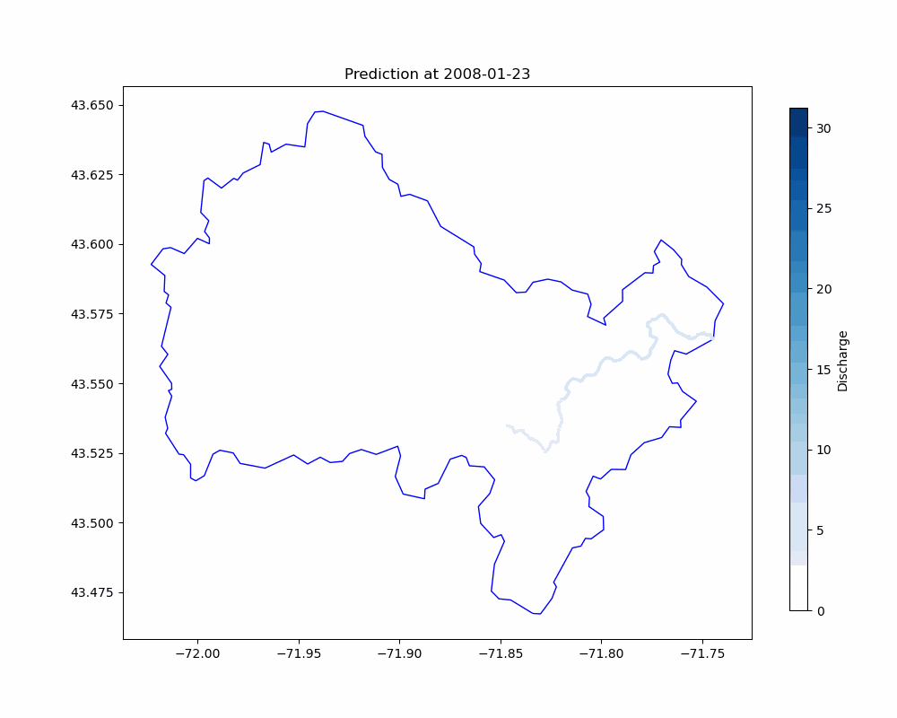

# GATWN
Graph Attention WaveNet

## Project Overview

## Requirements
- torch
- torch_geometric
- numpy
- pandas
- pyyaml
- python >= 3.11
- tqdm

## Recommendations
The example code was tested on an RTX-4060 TI 8GB GPU. It is recommended to set up a GPU environment with CUDA installed for optimal performance.

## Example Usage
The code execution examples are detailed in `example.ipynb`, which demonstrates streamflow prediction for USGS-01052500 gauge station. The example dataset focuses on main-stem river network structure.

